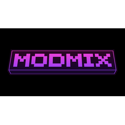

{ align=center width=200 }

# 🟪 MODMIX Wiki

Welcome to the official MODMIX Wiki. Find commands, FAQs, and guides for every MODMIX server.

## Server Addresses
- **OG Factions:** `play.modmix.studio`
- **Survival SMP:** `survival.modmix.studio`
- **Cobblemon:** `pokemon.modmix.studio`
- **Discord:** [discord.gg/6BMT3mfnfs](https://discord.gg/6BMT3mfnfs)

## About MODMIX
MODMIX is a community-first network with **no pay-to-win**. Cosmetic ranks are **earned in-game** via `/rankup` (requirements: MCMMO power + in-game currency + 30 XP levels).

### Servers
- **OG Factions** — OG-style factions with mcMMO, manual raiding, and classic cannoning. Version: **1.21.8**.
- **Survival SMP** — Vanilla+ with light QoL.
- **Cobblemon** — Pokémon + land claims + light economy.

### Quick Links
- [OG Factions](factions.md)
- [Survival SMP](survival.md)
- [Cobblemon](cobblemon.md)
- [Raiding & Cannoning Guide](raiding.md)
- [General FAQ](faq.md)
